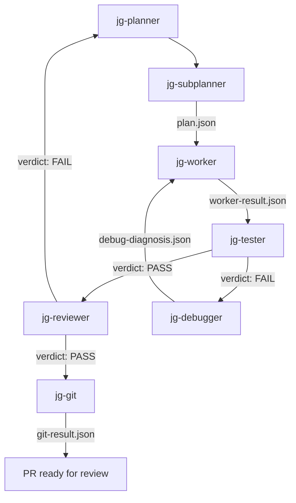

# Practitioner Tier

**This tier answers: Can you build and deploy AI features?**

Like being able to drive anywhere safely -- you know the rules, you've practiced, and you can handle unexpected situations on the road.

Copy this directory into your project as `.cursor/` to use the full pipeline.

```bash
cp -r .cursor-practitioner/* your-project/.cursor/
```

## Learning objectives

After reading this, you will be able to:
- Run the full pipeline on a real issue with testing, review, and failure handling
- Understand how each agent contributes to the pipeline and what artifacts it produces
- Extend the setup with new agents or rules for your team
- Delegate work to subagents and orchestrate the full pipeline
- Debug failures using the debugger/worker retry cycle

## Cursor documentation

Key references for the concepts covered in this tier:

- [Developing Features | Cursor Learn](https://cursor.com/learn/creating-features) -- End-to-end feature development with agents
- [Finding and Fixing Bugs | Cursor Learn](https://cursor.com/learn/finding-and-fixing-bugs) -- Debug and diagnosis workflows
- [Reviewing and Testing Code | Cursor Learn](https://cursor.com/learn/reviewing-and-testing-code) -- Code review patterns
- [Putting It Together | Cursor Learn](https://cursor.com/learn/putting-it-together) -- Combined pipeline workflows
- [Custom Agents | Cursor Docs](https://docs.cursor.com/agent/custom-agents) -- Agent definitions, AGENTS.md registry, `subagent_type` dispatch
- [Rules | Cursor Docs](https://docs.cursor.com/context/rules) -- `.mdc` rule files for pipeline behavior
- [Agent Skills | Cursor Docs](https://docs.cursor.com/context/skills) -- `SKILL.md` for reusable agent capabilities

## Quickstart

1. Copy this directory into your project as `.cursor/`
2. Enable the models listed in `AGENTS.md` in `Cursor Settings > Models`. Some models (e.g. `gpt-5.1-codex-max`) are hidden by default. See [Models | Cursor Docs](https://cursor.com/docs/models).
3. Create a GitHub issue with acceptance criteria
4. Paste this into Cursor:

> "Work on issue #[number]. Read the issue body and acceptance criteria. Plan the implementation, implement it, run tests, review the code, then create a branch, commit, and open a PR."

Artifacts appear under `.pipeline/<issue-id>/` as each stage completes.

## Pipeline flow



The planner orchestrates the full pipeline. On test failure, the debugger diagnoses the issue and the worker retries. On review failure, the planner re-routes. After 2 retries on any stage, the planner escalates to a human.

See [Developing features](https://cursor.com/learn/developing-features) for how the plan-then-implement pattern works in practice, and [Putting it all together](https://cursor.com/learn/putting-it-together) for an end-to-end walkthrough from the Cursor team.

## Agents

| Agent | Role | Model | Reads | Writes |
|-------|------|-------|-------|--------|
| [jg-planner](agents/jg-planner.md) | Orchestrates pipeline, routes failures | gemini-3.1-pro | All artifacts (read-only) | state.yaml |
| [jg-subplanner](agents/jg-subplanner.md) | Decomposes issue into ordered steps | gpt-5.1-codex-max | Issue body | plan.json |
| [jg-worker](agents/jg-worker.md) | Implements code and tests | gpt-5.3-codex | plan.json, debug-diagnosis.json | worker-result.json |
| [jg-tester](agents/jg-tester.md) | Two-phase verification | gemini-3-flash | (runs commands) | test-result.json |
| [jg-reviewer](agents/jg-reviewer.md) | Quality gate for scope and correctness | gemini-3.1-pro | plan.json, worker-result.json | review-result.json |
| [jg-debugger](agents/jg-debugger.md) | Diagnoses test failures | claude-4.6-sonnet | test-result.json, plan.json | debug-diagnosis.json |
| [jg-git](agents/jg-git.md) | Branch, commit, PR | gemini-3-flash | (git state) | git-result.json |
| [jg-benchmarker](agents/jg-benchmarker.md) | Model cost/performance evaluation | gemini-3-flash | Benchmark sources | Snapshot files |

**jg-benchmarker** is on-demand, not a pipeline stage.

## Failure and retry walkthrough

The `walkthrough/` directory contains a complete traced example: "Add user authentication middleware" (issue #42). It demonstrates a realistic pipeline run where the tester catches a bug, the debugger diagnoses it, and the worker fixes it.

See [walkthrough/narrative.md](walkthrough/narrative.md) for the step-by-step narration, and [walkthrough/scenario.md](walkthrough/scenario.md) for the issue description.

The walkthrough includes:
- A test failure (off-by-one in JWT expiry check)
- Debugger diagnosis pointing to the exact file and line
- Worker fix and successful retest
- Reviewer approval with minor nits
- PR creation with conventional commit

Each artifact file in `walkthrough/` is a realistic example of what that agent produces. You can validate them:

```bash
python .cursor/pipeline/schema.py --validate .cursor/walkthrough/plan.json
```

See [Finding and fixing bugs](https://cursor.com/learn/finding-and-fixing-bugs) for more on how agents handle failures.

## Extending the setup

### Add a new agent (worked example: team-linter)

Suppose your team wants a dedicated linter agent that runs after the worker and before the tester, writing `lint-result.json`.

1. **Copy the template and fill it in**
   - Copy `templates/agent.md` to `agents/team-linter.md`
   - Set `name: team-linter`, `model: gemini-3-flash`, and a one-line `description` (e.g. "Runs project linter and writes result; use when verifying code style before tests.")
   - In the body: ROLE (runs linter, writes result), CORE RESPONSIBILITIES (read plan/worker-result, run `npm run lint` or project equivalent, write `.pipeline/<issue-id>/lint-result.json` with `verdict`, `output`), NON-GOALS, and the artifact filename in OUTPUT.

2. **Add the agent to AGENTS.md**
   - Add one row to the main table in the same format as the existing rows:
   - `| **team-linter** | gemini-3-flash | Run linter before tests | plan.json, worker-result.json | lint-result.json |`
   - Add a line to the Pipeline order section (e.g. "2.5. **team-linter** — After worker; writes `lint-result.json`. On FAIL → planner re-dispatches worker or escalates.")
   - In Subagent types, add `linter` → team-linter.

3. **Wire it into the planner**
   - Edit `agents/jg-planner.md`. In CORE RESPONSIBILITIES, insert the new stage in the happy path (e.g. after "Worker reports completion" and before "invoke tester": "Worker reports completion -> invoke team-linter; Linter PASS -> invoke tester").
   - In PIPELINE ARTIFACTS, add: `Lint result: .pipeline/<issue-id>/lint-result.json`.
   - If you add a new artifact type, add its required fields to `pipeline/README.md` and to `pipeline/schema.py` in the `REQUIRED` dict.

4. **Optional**: Add `lint-result.json` to the pipeline skill and to `check.py` if you want stage-gate checks for the lint stage.

### Add a new rule

1. Copy `templates/rule.mdc`
2. Set `description` (this is how Cursor decides when to apply it) and `alwaysApply`
3. Write the rule body

See [Customizing agents](https://cursor.com/learn/customizing-agents) for more on tailoring agents and rules.

### Project customization: language- or stack-specific rules

Use `team-*` rules to tell agents how to run tests, lint, and typecheck in your project. Examples:

- **Node/TypeScript** — Create `rules/team-node-conventions.mdc` with `description: Node/TS project conventions` and body that specifies: "Tests: run `npm test`. Lint: `npm run lint`. Typecheck: `npm run typecheck`. Use the project's `package.json` scripts; do not assume global installs."
- **Python** — Create `rules/team-python-conventions.mdc` with body: "Tests: `pytest` (or `make test` if the project uses it). Lint: `ruff check` or `flake8`. Typecheck: `pyright` or `mypy`. Activate the project venv before running commands when one is present."
- **Monorepo** — Create `rules/team-monorepo.mdc` that describes which packages are affected by a change and how to run commands per package (e.g. `pnpm --filter <pkg> test`).

These rules are picked up by the planner and by the tester so that "run tests" and "run lint" use the right commands without editing `jg-` files.

### Naming conventions

- `jg-*` files are shared upstream — don't modify them in your project
- Name team additions `<team>-*` (e.g. `acme-api-standards.mdc`, `team-linter.md`)
- Name personal additions without prefix

## What changed from Foundation

| Addition | What it does |
|----------|-------------|
| **jg-subplanner** | Decomposes complex issues into ordered steps with file-level granularity before the worker starts |
| **jg-tester** | Two-phase verification: Phase 1 (lint, typecheck, unit tests), Phase 2 (integration, E2E). See [Reviewing and testing code](https://cursor.com/learn/reviewing-and-testing-code) |
| **jg-reviewer** | Quality gate that catches scope creep, overengineering, and convention violations |
| **jg-debugger** | Classifies failures as fix_target (worker can fix), plan_defect (need to re-plan), or escalate (human needed) |
| **Skills** | Reusable instruction sets (`jg-pipeline-artifact-io` for artifact I/O, `jg-benchmark-ops` for model evaluation). See [Cursor docs: Skills](https://docs.cursor.com/context/skills) |
| **Pipeline validation** | `schema.py` validates artifact structure, `check.py` validates stage-gate invariants |
| **Templates** | Starting points for new agents, rules, and artifact examples |

## Model fallbacks

| Agent | Default model | Fallback |
|-------|--------------|----------|
| jg-planner | gemini-3.1-pro | Any reasoning model |
| jg-subplanner | gpt-5.1-codex-max | Any code-capable model |
| jg-worker | gpt-5.3-codex | Any code-capable model |
| jg-tester | gemini-3-flash | Any fast model |
| jg-reviewer | gemini-3.1-pro | Any reasoning model |
| jg-debugger | claude-4.6-sonnet | Any reasoning model |
| jg-git | gemini-3-flash | Any fast model |
| jg-benchmarker | gemini-3-flash | Any fast model |

If a model isn't available, substitute and expect more retries from cheaper models.

## Troubleshooting

**Tester failed but the code looks correct**
Check that test commands match your project (e.g. `make test` vs `npm test` vs `pytest`). The tester runs whatever commands are configured.

**Debugger classified as "escalate"**
The failure is beyond agent capability. Review the `debug-diagnosis.json` manually and fix the issue.

**Reviewer keeps failing on scope**
Check that `plan.json` `affected_files` matches what the worker actually changed. Scope drift causes review failures.

**Agent didn't pick up a rule**
Verify the rule file is in `.cursor/rules/`, has valid frontmatter, and the `description` accurately describes when it should apply.

**Pipeline artifacts not appearing**
Check `.pipeline/<issue-id>/` exists. The planner creates this directory at the start of a run.

## Claude Code

Pipeline concepts (artifacts, agent roles, stage gates) are IDE-agnostic:

| Cursor | Claude Code |
|--------|-------------|
| `.cursor/rules/*.mdc` | `CLAUDE.md` at repo root |
| `.cursor/agents/*.md` | Referenced docs in `CLAUDE.md` |
| `.cursor/skills/*/SKILL.md` | `.claude/commands/*.md` |
| `subagent_type` dispatch | Sequential prompting through stages |

Walkthrough content and pipeline artifacts work in both environments.

## Cost

A typical pipeline run invokes 4-6 agents. Each agent call is a separate AI model invocation. For cost-optimized model selection across agents, see the Expert tier's tiered routing approach.

## Maintenance

These files are derived from the root `.cursor/` bundle. When the bundle is updated, check this directory for changes.

### Tutorials

See `tutorials/` for 6 hands-on exercises. You will set up a real project, delegate to subagents (subplanner, worker, tester, debugger, reviewer, git), handle failures, and extend the pipeline. See [tutorials/README.md](tutorials/README.md).

### Portfolio

Complete 1 deployed AI use case by working through exercises 01-05. You will have implemented, tested, debugged, reviewed, and shipped a feature using the full multi-agent pipeline.

### Assessment

Technical demo + walk-through with an Expert. Walk through your deployed feature, show the pipeline artifacts, explain how you handled the test failure, and demonstrate the team-linter extension.

## Next steps

To add tiered model routing (fast/standard/high agents), cost tracking, and multi-issue orchestration, see `.cursor-expert/`.
